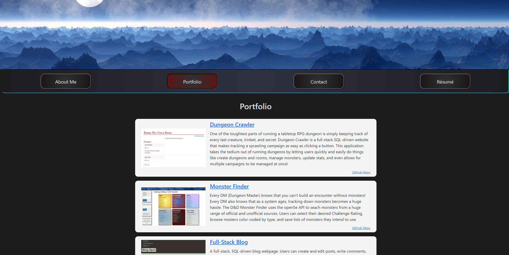

# React Portfolio

Welcome to my React-based portfolio! Here you'll see a sampling of my work, along with a brief biography, contact information, and a downloadable resume.

## Description
This is a component-oriented design, rendering objects as needed on the fly. The single-page design allows for immediate load times and provides a slick user experience.

[GitHub Repository](https://github.com/the-wake/a20-react-portfolio)

## Installation
No installation is needed. The application front-end is run through GitHub Pages using React.

## Functionality
The page is built using React, React Bootstrap, and MUI. However, I borrowed only a couple of elements from the CDNs, and instead built most of the style from the ground-up to meet my needs and desires for the page layout.

In addition to a brief bio, the page contains seven projects that are rendered as components in a Portfolio page. These all contain links to live applications (where relevant) and the GitHub repos. The Contact page renders a contact form, as well as an email link and LinkedIn page. Finally, Résumé downloads a PDF of my résumé to the user's device.

The page is heavily reactive, displaying well for displays down to 400px in width. The navbar uses the _sticky_ property to affix to the top of the screen once the user scrolls past it, so that they can easily jump from page to page. In addition, the banner image automatically adjusts itself to 90% of user viewport height, to provide a beautiful landing image without obstructing navigation.

## Tools Used
* JavaScript
* NPM
* React
* React Bootstrap (sparingly)
* MUI (sparingly)
* GitHub
* GitBash
* Coded in VS Code

## Future Functionality
* I'd like to have the links adjust the user's scroll position, but haven't found a good way of doing that yet.
* More styling, especially reactive styling and transitions, would really help the page pop.
* I'd like to add more projects as I create them.
